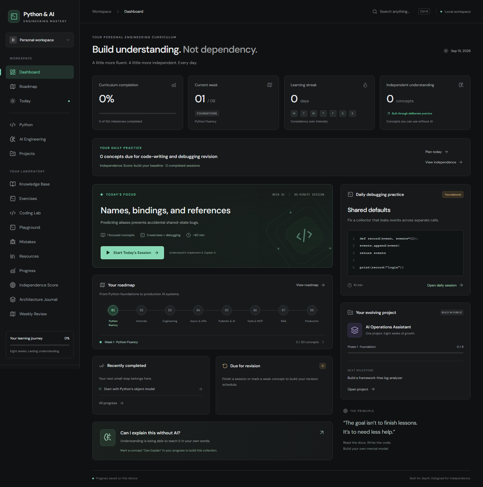

# Python & AI Engineering Mastery

An open-source personal learning system for independently designing, implementing, debugging, and explaining Python and AI engineering systems.

[Try the live dashboard](https://MilanDanilovic.github.io/python-and-ai-engineering-mastery/) ? [Browse the tutorial](docs/curriculum/README.md) ? [Contribute](CONTRIBUTING.md) ? [MIT license](LICENSE)



## What you can learn

An eight-week curriculum with **152 granular milestones**, **608 exercises with click-to-reveal reference solutions**, official documentation, searchable tags, and a visual prerequisite map. Topics progress from Python's object model, functions, decorators, generators, typing and testing to asyncio, FastAPI, Pydantic, agent architecture, MCP, ontology, RAG, retrieval, DBOS, security, and human approval.

Code appears in a **Monaco editor with the existing dark green theme**, Python syntax highlighting, line numbers, folding, and copy controls. Your attempts autosave; references are read-only and stay hidden until requested. Python executes in a Pyodide Web Worker with a five-second timeout, stdout/stderr, and automated checks for 24 curated exercises. Roadmap reveal history is recorded separately from daily-session assistance metrics.

## How to use it

1. Open the roadmap and start with a concept whose prerequisites you understand.
2. Click **Start Today's Session** for an approximately 80-minute session combining review, coding from memory, exercises, debugging, documentation, design, and reflection.
3. Write code locally, record your verification evidence, and reveal hints or references only when needed.
4. Rate confidence honestly, note mistakes, and return for scheduled revision and weekly reviews.

You can also work through the [Markdown tutorial](docs/curriculum/README.md) directly on GitHub without running the app. For dependencies and runnable-example limits, see [Example setup](docs/EXAMPLES.md).

This is a community learning project, not an accredited course or a certification. Its aim is engineering independence rather than a completion badge.

## Run locally

Requirements: Node.js 22+ and npm. Local Python 3.11+ is needed for offline exercises and reference checks, but not to launch the dashboard or use browser Python.

```sh
npm ci
npm run dev
```

Open http://127.0.0.1:5188. Use `npm run build` for a production bundle. Forks can deploy with the included GitHub Actions workflow after enabling **Settings ? Pages ? GitHub Actions** and setting the Vite base path to their repository name.

The app includes an eight-week roadmap with **152 individual learning milestones**, exercises, project milestones, notes, a mistake journal, official resources, and independent completion/mastery assessment.

Each curriculum milestone contains an explanation, rationale, prerequisites, difficulty, documentation, optional reading, code concepts, two simple exercises, one practical exercise, one debugging exercise, interview and explanation prompts, a checklist, mastery assessment, and notes. Exercise responses and notes save independently per milestone.

Search the roadmap by title, code concept, or tag; filter by week and tag. Global search (Ctrl/Cmd K) also shows each result's week. The dependency map displays 273 prerequisite links, supports tracing a concept's complete ancestry, and provides a full-curriculum view, zoom, and direct navigation into milestone details. Prerequisites indicate readiness without locking content.

Existing browser data is retained. Equivalent older concepts map to their new milestones; broad category completion does not automatically complete the new subtopics. Completion does not alter mastery.

Progress is stored in localStorage on the current browser. Export a JSON backup from Progress. There is no account or server synchronization. Browser-compatible code runs locally in a Pyodide worker. Server, database, and multi-service exercises require your own Python environment.

## Daily practice

**Start Today’s Session** creates or resumes one saved daily session. Plans target 80 minutes and contain Concept Review, Coding From Memory, Exercises, Debugging, Documentation Practice, a Practical Engineering Challenge, and Reflection. The planner selects up to two concepts from ready roadmap milestones and due weak-area revisions. Unfinished sessions survive reloads and can be resumed on a later day; repeated starts do not overwrite attempts.

Every task has observable verification criteria. Hints and reference solutions remain hidden until requested, and their use is retained. Record passed, partially correct, or not solved results alongside local test evidence. Executable daily tasks record actual browser test results; other engineering tasks use **self-verified results**. Some architecture tasks use reference designs rather than executable solutions. The Coding Lab includes implementation, debugging, prediction, refactoring, code reading, architecture, async, testing, typing, and AI engineering exercises. Async labs using TaskGroup and asyncio.timeout require Python 3.11+; library-specific labs require their documented packages (Pydantic examples use v2; MCP server examples use SDK v2).

At reflection, rate each topic from 1–5. High confidence (4–5) with performance below 60% is flagged as **False Confidence**; low confidence (1–2) with performance at least 80% is **Needs Reinforcement**. Failed, assisted, or uncertain topics return after about one day. Independent successful revisions move through 1, 3, 7, 14, and 30 days. Each return includes implementation and debugging, not just recall. A milestone can also be marked for revision from its detail page.

Completing a daily session schedules practice. Roadmap completion is a separate explicit checkbox, and mastery is never inferred automatically. Reflections suggest editable mistake-journal drafts; accepting a draft adds one journal entry and schedules its concept for revision.

## Independence and architecture

**Independence Score** shows seven observed rates: unassisted exercise success, attempts without hints, attempts without revealed solutions, documentation used without AI, independent debugging success, architecture decisions recorded before AI/reference assistance, and verified explanations. The score is the equal-weight average of observed rates, excludes unknown categories, and uses completed sessions plus assessed browser exercises. Raw counts and the calculation are visible.

The **Architecture Journal** records the problem, proposed architecture, data flow, abstractions, failure modes, alternatives, rationale, later AI suggestions, and changes. The practical session asks for a saved design before the coding field becomes available. Original design fields are preserved after commitment; subsequent AI suggestions and changes can be recorded later. Project pages also offer a design-first journal entry. The six-question **Before Asking AI** checklist is available in every session stage.

## Weekly review

Every seven calendar days from the first use of the daily-learning feature, the dashboard surfaces a review. It includes recorded completions and mastery changes, weak concepts, repeated mistake topics, difficult concepts, revealed solutions, due revision, project changes, independence change, and recommended focus. Previous periods remain selectable, and recording a review freezes its evidence summary. No dates are invented for work completed before this feature was introduced.

## Browser checks

With the development server running, run `npx playwright install chromium` followed by `npm run test:smoke`. The smoke check covers local persistence, navigation, notes, exercise filters, mastery, search, and mobile overflow.

Run `npm test` for curriculum completeness, dependency ordering and cycle detection, search, readiness, and migration checks. With the development server running, `npm run test:curriculum` checks milestone persistence, prerequisite navigation, search filters, all graph nodes, and responsive layouts in a fresh browser context.

`npm test` also verifies daily selection, cross-day resumption, revision intervals, calibration, assistance-sensitive scoring, completion requirements, weekly windows, project snapshots, and mistake suggestions. With the server running, `npm run test:daily` exercises a complete daily workflow and a later weekly review on desktop and mobile.

Curriculum content and stable prerequisite IDs live in `src/curriculum.js`; the second exercise for each milestone lives in `src/second-exercises.js`. Curriculum UI components reuse the existing design in `src/Curriculum.jsx` and `src/curriculum.css`.

## Repository structure

- `src/curriculum.js`: milestone content and prerequisites.
- `src/solutions/`: four authored reference answers per milestone.
- `src/learning-engine.js`: daily planning, revision, confidence and review logic.
- `src/CodeEditor.jsx`: shared themed editor and explicit solution reveal.
- `docs/curriculum/`: generated, browsable tutorial with collapsible answers.
- `tests/`: learning logic, Python syntax, and browser workflow checks.

## Development and deployment

Run `npm test`, `npm run test:examples`, and `npm run build`. With the dev server running, use `npm run test:solutions` to check hidden references and `npm run test:runner` to check actual execution, timeout recovery, predictions, persistence, and mobile layouts. `npm run test:contracts` validates all 24 executable references against real browser Pyodide. GitHub Actions repeats validation before publishing to GitHub Pages.

Study data stays in your browser. Clearing site data removes it, and the local and hosted apps have separate browser storage. Export a backup from Progress before clearing data. No AI provider credentials are needed to use the dashboard. Pyodide and optional packages download on first use.

## Interactive Python workspace

Open **Coding Lab** for tested exercises or **Playground** for free experimentation and ten examples. Use **Run Code**, **Run Tests**, or **Ctrl/Cmd Enter**. The editor can be resized vertically. Predictions must be submitted before code runs. Solutions require confirmation and record assistance; completion still requires passing checks.

See [execution architecture and limitations](docs/EXECUTION.md) for the provider interface, worker lifecycle, package loading, hidden-test behavior, and progress integration.
